# JavaScript操作RDF的类库

## 摘要

本文提出了一个纯JavaScript实现的RDF存储方案，并且支持SPARQL查询语句，以及兼容运行于前后端JavaScript平台中。在此基础之上，本文还提出了一个JavaScript类库的声明，使得我们可以有效地将RDF作为JavaScript应用的数据层。

**关键词**：JavaScript, RDF, SPARQL

## Abstract

In this paper we present a pure JavaScript implementation of an RDF store supporting the SPARQL query language that can be executed in modern browsers as well as in server side JavaScript platforms. We alse present a declarative JavaScript library based on this store, that makes it possible to use RDF as the data layer for stand-alone JS applications. 

**Keywords**: JavaScript, RDF, SPARQL

## 引言

随着英特网应用的普及和软件技术的进步，基于Web的网络计算模式得到了广泛的重视和应用。随着以前的技术开始难以解决人们期待已久的智能搜索引擎、智能信息代理、智能交易代理等基于Web的个性化智能化的服务，语义网（Semantic Web）开始出现了。基于语义网，W3C等研究机构制定了一系列新的应用于Web的技术标准，其中RDF就是很重要的一项标准。

除此之外，一门新兴的技术Node.js将JavaScript这门脚本语言推上了一个历史的高度，使本来就流行在Web前端的JavaScript语言开始向Web后端进发。于是将JavaScript支持RDF也开始重要起来。

## 什么是RDF

RDF为Resource Description Framework（资源描述框架）的缩写。资源即所有在Web上被命名、具有URI的事物，如网页、XML文档中的元素等；描述即对资源属性的一个陈述，以表明资源的特性或者资源之间的关系。综合起来，RDF就是定义了一种通用的“资源——属性——值”三元组的框架，用以描述Web上的各种资源。

其有多种载体格式，如Turtle、JSON-LD、XML等。而关于RDF模型，大致可以分为以下几个部分：

### 三元组

RDF允许我们做关于资源的陈述，这些语句的格式很简单。声明总是具有以下结构：

> <主体> <谓词> <对象>

一个RDF陈述表达了两个资源之间的联系，即主体和对象之间的关系。谓词就是两个资源的关系了。这样的一组关系在RDF中被称为属性，而这样的一个属性包含三个元素，所以被称为三元组。

为了更直观地表现RDF中的三元组，图2-1和图2-2将举几个三元组的例子。

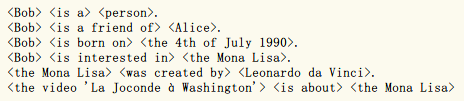

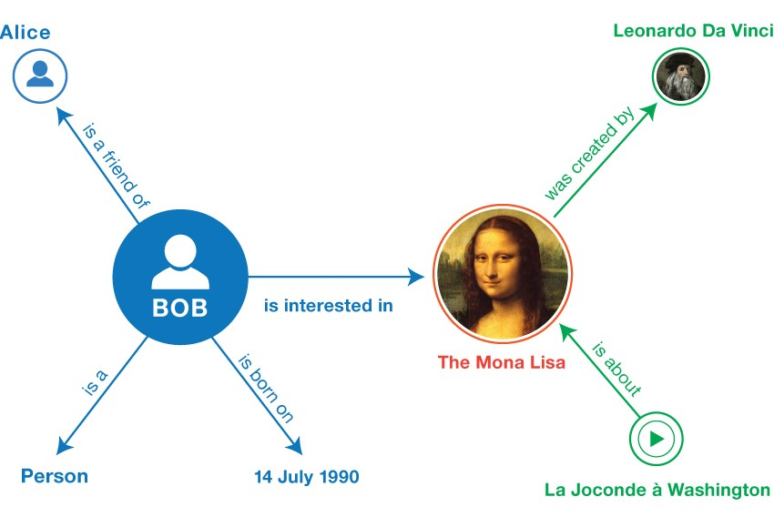

### IRI

IRI为International Resource Identifier（国际资源标识符）的缩写。其中人们平时上网用的网址，URL（Uniform Resource Locators，统一资源定位器）就是IRI的一种形式。

IRI可以出现在RDF三元组三个位置中的任意位置。

### 文本

文本是RDF中非IRI的基本值，只出现于三元组的主体和对象位置中，它的类型可以是字符串、日期、数值等等。而字符串类型的文本可以与语言标签结合。如“Léonard de Vinci”可以与“fr（法语）”关联、“李奥纳多•达•文西”与“zh（中文）”关联。

### 空节点

IRI和文本为RDF陈述准备了基础材料。此外，我们可以很方便地拿一个并未被全局标识资源进行陈述。例如蒙娜丽莎的油画背景中有一棵未被标识的树是一棵柏树。一个并未被全局标识的资源在RDF中将被一个空节点表示。

空节点可以出现在主体和对象位置中。他们可以在没有明确IRI命名的情况下被使用。

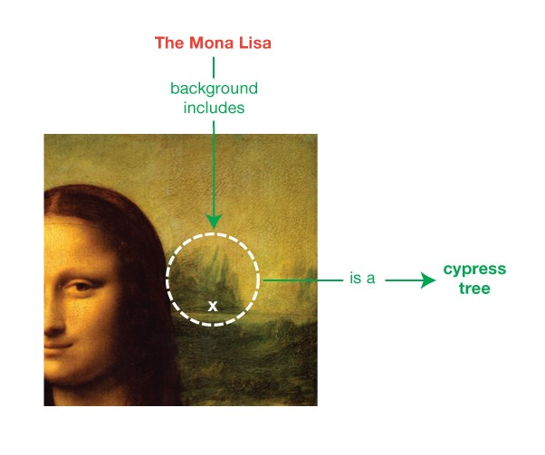

### 复合图

RDF提出了一个将RDF陈述聚合在一个复合图中并将他们用IRI关联的机制。复合图是最近才被加入到RDF数据模型中的一个扩展。

复合图在RDF文档中构成RDF数据集。一个RDF数据集可以包含多个命名图和最多一个未命名图。

举个例子，图2-4的RDF可以是被一个社交网络提供并且被标识为http://example.org/bob。

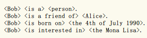

第二张图由Wikidata提供，被标识为https://www.wikidata.org/wiki/Special:EntityData/Q12418，如图2-5所示。
    
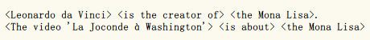

第三张为一张未命名图，包含了两个三元组，都是以图&lt;http://example.org/bob>为主体。三元组关联了主体的发布者和许可。如图2-6所示。
    
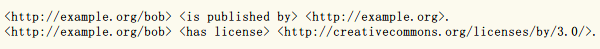

这三个图将聚合成一个复合图，即数据集，如图2-7所示。

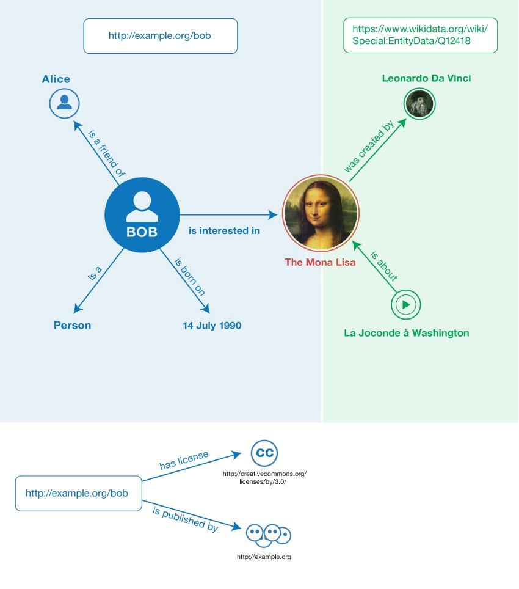

## RDF主要表现格式

### RDF/XML

RDF/XML提供了RDF图的XML格式。在该格式中，三元组在XML元素rdf:RDF中被指定。rdf:RDF中的属性定义了命名空间。元素Description将定义一系列三元组。

图3-1将会给出一个基本的RDF/XML例子。若想深入了解RDF/XML语法格式等，可以详细参考RDF11-XML文档。

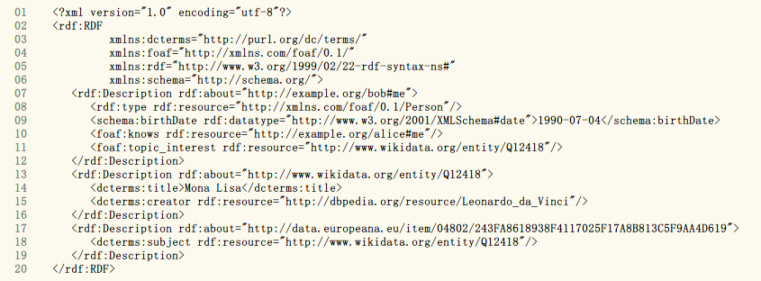

### JSON-LD

JSON-LD的语法是参照JSON标准来的。在此基础上，增加了特定的语法标记和关键词，如“@context”、“@id”、“@value”等，详见JSON-LD文档 。

图3-2就是一个JSON-LD的例子。

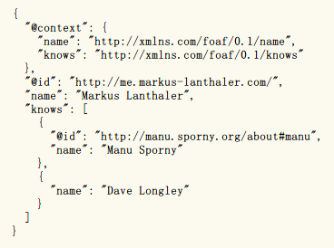

## SPARQL

SPARQL是一种用于RDF上的查询语言，它的名字跟Wine类似，是一个递归缩写，代表“SPARQL Protocol and RDF Query Language”。

一个SPAQRL查询由一些三元组、与逻辑、或逻辑以及选项组合所组成。可以让用户写出广域上不含糊的询问。举例来说，以下的询问可以取得世界上所有人的姓名与邮箱：

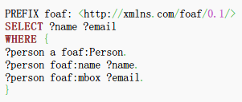

## RDFStore-js

### RDFStore-js介绍

RDFStore-js 是一个基于纯JavaScript实现的RDF存储模块，可以运行在浏览器端和Node.js 服务端，它支持SPARQL的查询和更新语句。

RDFStore-js支持所有SPARQL1.0标准以及基本上所有的SPARQL1.1标准。Node.js版本还实现了RDF的SPARQL协议使其可以用于独立的SPARQL终端，通过HTTP请求被访问。

这个类库的主要目的就是为复杂的JavaScript客户端程序提供数据层的基础。它也可以被使用RDF作为API传输格式的服务端应用所使用。

其支持使用浏览器或者附加的输入输出接口通过SPARQL查询从远程载入RDF。它的解析器所支持的格式有JSON-LD和N3/Turtle等。其它格式也可以通过扩展的方式加入到支持中来。

### 设计

RDFStore-js采用了高级浏览器特性的优势，提供持久化储存和多线程执行，前提是浏览器需要支持这些特性。而在Node.js中，这些特性也是存在的。

#### 内存存储和索引

RDFStore-js的存储模型是基于一个将主体、谓语、对象和附加的图URI存储在一个词典组件中的单概念表。此外，一系列的B-Tree索引会被生成以此来提高查询的效率和性能。这些索引是需要覆盖在不同模式下的SPARQL基本查询和用于在词典中高速范围扫描的最小数目。

#### 持久化存储

由于浏览器JavaScript和Node.js存储层的差异，RDFStore-js的持久化存储对于浏览器JavaScript和Node.js做了不同的实现。

浏览器层是基于Web Storage API 实现的。该API定义了一个localStorage对象来包含一个持久化键值对map。存储容量只有几个兆字节，15M是目前大多数实现的默认容量。字典和索引使用一种JSON的自定义序列化方案编码保存在这个持久层。

持久化存储搭配缓存组件使用。由于Web本地存储的大小限制，整个存储同时可以放在主内存中。

而在Node.js中的持久化中，主要使用的是MongoDB 作为RDF图的存储引擎，而RDF也会被编码为MongoDB中的文档。

#### SPARQL查询分析和过程

应答查询流程的第一步是先要解析SPARQL语句。整个过程分为两步。首先，文本SPARQL查询将会被解析为一个复杂的JSON对象，其代表了一棵对于该查询抽象的语法树。第二步，语法树会被转化为一个不同的包含等价SPARQL表达式的JSON对象。

解析步骤的执行使用了一个解析表达式语法（Parsing Expression Grammar, PEG ），它能够解析SPARQL查询、SPARQL1.1、SPARQL更新语句，此外它还能解析Turtle文档。

#### 线程执行

执行在浏览器中或者Node.js中的JavaScript程序，除了Web Workers API之外，都被限制在单线程当中。为了防止I/O密集运算造成的阻塞，JavaScript平台提供了事件驱动的异步接口。

不过JavaScript应用程序是单线程的这一点有一个例外，就是Web Workers API。这个API允许JavaScript代码在不同的沙箱线程中执行。两个线程之间不能共享任何状态，通过专门的字符串消息交换来通讯。

RDFStore-js充分利用了这个API的优势，在不同的线程中查询SPARQL语句。上层为“Store”模块。这个模块定义了对外的最终接口，即客户端代码能调用的一系列异步函数。如果Web Worker API被探测到，那么这个模块将会在Web Worker中被加载，另一个“RDFStoreClient”模块会在主线程中被加载。两个模块都是先了相同的接口，但是调用RDFStoreClient模块中的方法实际上是发送消息给先前创建好的Web Worker中。当最终查询结果出来的时候，会触发时间通过一个异步回调的函数返回给客户端代码。两个线程之间结果和请求参数的编码和解码是由标准JSON中的toStringSerialization来完成的。

此外，如果浏览器不支持Web Workers，那么Store模块会直接创建在主线程当中，而不会说出现不兼容的情况或者需要客户端代码做额外的修改。

#### 评量基准

RDFStore-js的性能评估已在性能平均的笔记本电脑上使用LUBM 标准在不同的浏览器中完成。测试用例使用LUBM数据生成器生成并且转化为JSON-LD格式。数据最终在一个RDF图中加载了100545组三元组。

表5-1展示了以毫秒为单位的结果。由于RDFStore-js不支持推理，其中一些评估查询使用UNION子句被重写为显式模式。除此之外，还额外添加了一个简单返回所有三元组的查询。查询文本 以及运行测试的代码都被包含在了分发出来的类库源代码中。

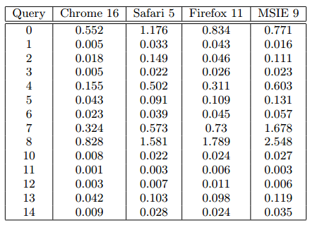

#### 事件API

JavaScript客户端应用需要响应用户事件来改变应用状态。其导致的结果就是当这些状态结果改变的时候应用的不同组件需要被更新。

为了更简易地构造这类事件的调度逻辑，RDFStore-js添加了一个事件API。作为公开接口的其它部分，这个事件API可以在两种不同的级别被使用——SPARQL查询级别和RDF结点级别。

在SPARQL查询级别，客户端代码可以通过调用 `startObservingQuery/stopObservingQuery` 函数来订阅SPARQL查询。每当RDF图中的修改引起了查询结果的改变，而其又被事件API跟踪的时候，新的结果集将会被返回到订阅的回调函数当中。

在RDF节点级别，`startObservingNode/stopObservingNode` 函数调用之后，每当RDF图的一个节点状态被改变的时候，节点新的值就会根据RDF接口规范被返回给回调函数。

#### JavaScript-RDF应用类库

SemanticKO 是一个补充的应用程序开发库的实现，建立使用RDFStore-js存储的RDF图和HTML文档中的DOM树之间双向绑定的声明。该库是从KnockoutJS 的Repo当中Fork过来的。KnockoutJS是一个实现了MVVM(Model-View-ViewModel)模式的JavaScript类库。

下方的代码片段展示了一个例子：

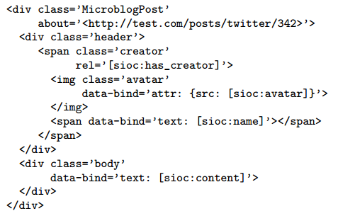

绑定的JavaScript节点对象通过事件API订阅了在RDFStore-js中的RDF节点的修改事件。每当RDF节点的值改变了，节点对象就会被通知并且修改相应观察的属性值。被观察的属性变化触发了绑定到相关RDF节点的DOM结点依赖的重判断，或者触发在data-bind属性中声明的值的变化。作为结果，一个被更新的DOM树将会映射出RDF图的更新。相互的，DOM树的变化也会自动更新到相应的RDF节点中去。

## 小结

RDFStore-js实现了一个可以用作客户端应用的数据层基础的RDF存储功能，它支持持久化存储、查询、操作从不同源获取的数据并且非常简单地合并在一起，这得益于RDF数据模型和SPARQL查询语言。

RDFStore-js展示了RDF数据是如何存储的以及SPARQL查询语言可以在Web开发中扮演一个相当重要的角色，不仅仅是服务端程序的持久层，也可以在客户端程序的中间件层。

该存储还提供了不同粒度下的API，有的基于原始SPARQL查询和RDF图的序列，还有的API是将RDF节点转化为JSON对象进行操作。这个API也是一个使用最新的语义标准在JavaScript应用中集成RDF数据的例子。

此外，RDFStore-js还提供了事件API，可以很好的适应JavaScript异步执行的模型。SemanticKO就是基于这个事件API构建的提供Web应用开发的类库，它只需要在DOM树和RDF图之间声明绑定就可以在应用中进行数据值的双向更新。

## 参考文献

* [1] Antonio Garrote Hernández, María N. Moreno García. A JavaScript RDF s-tore and application library for linked data client applications[C]// ***World Wide Web Conference 2012.*** [s. n.]: [s. n.], 2012.
* [2] W3C Working Group. RDF 1.1 Primer[EB/OL]. [2014-02-25] http://www.w3.org/TR/2014/NOTE-rdf11-primer-20140225/
* [3] 赵建建. XML/RDF技术在数字图书馆信息资源整合中的应用[J]. ***Inner Mongolia Science Technology & Economy,*** 2013-1: 68-71.
* [4] J. Smith. WPF Apps With the Model-View-ViewModel Design Patter[J]. ***MSDN Magazine,*** 2009-2.
* [5] 刘一宁. 语义网主要技术发展分析[J]. ***Information Research,*** 2011-9.
* [6] 刘立. MVVM模式分析与应用[J]. ***Microcomputer Applications,*** 2012-12: 57-60.
* [7] Guillermo Rauch. Smashing Node.js – Javascript Everywhere[M]. America: ***Wiley,*** 2012.
